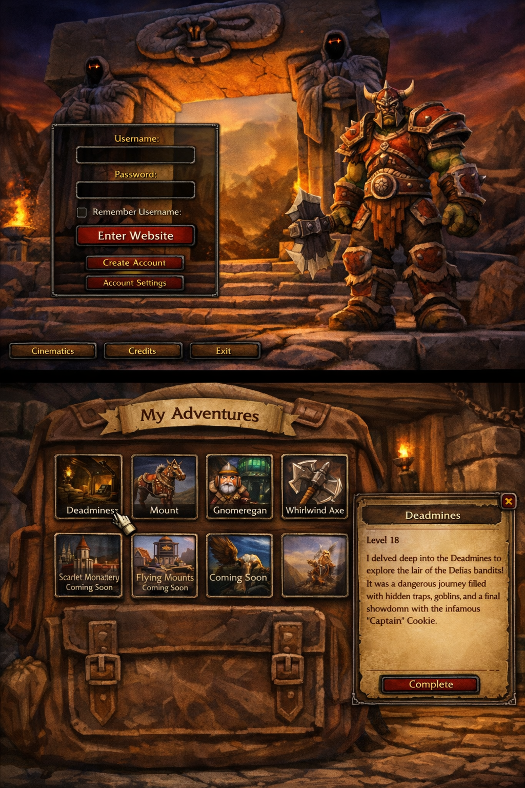

# Warcraft Journal Site

This site is a static HTML/CSS/JS project. Posts are written in Markdown and loaded from the `posts/` folder.

## Run Locally

Start a local web server from the project root:

```powershell
python -m http.server 8000
```

Then open:

```text
http://localhost:8000/blog.html
```

If `python` is not installed, you can use Node instead:

```powershell
npx serve .
```

Do not open `blog.html` directly with `file://...`, because the post Markdown files will not load correctly that way.

## How Posts Work

- Every `.md` file in `posts/` is treated as a post.
- The post id is the file name without `.md`.
- The display title is derived from the file name.
- Underscores and hyphens become spaces.
- Each word is capitalized.
- Example: `whirlwind_axe.md` becomes `Whirlwind Axe`.
- The slot image is read from `assets/<id>.png`.
- Example: `posts/mount.md` uses `assets/mount.png`.

If you add, remove, or rename a file in `posts/`, regenerate the manifest:

```powershell
node scripts/generate-post-manifest.js
```

If you only change the contents of an existing post, you do not need to rerun the manifest command. A browser refresh is enough.

## New Post

1. Create a new Markdown file in `posts/`.
2. Name it using lowercase words with underscores if needed.
3. Add a matching PNG in `assets/`.
4. Run:

```powershell
node scripts/generate-post-manifest.js
```

5. Refresh the site.

Example file: `posts/my_new_post.md`

```md
<!-- posted: 2026-04-09 -->

# My New Post

Short summary shown in the side panel.

---

The rest of the story starts here.
```

Matching image:

```text
assets/my_new_post.png
```

## Planned Post

If you want a post to show in the backpack but not be readable yet, mark it as planned.

1. Create the file in `posts/`.
2. Add `<!-- status: planned -->` at the top.
3. Keep only the summary section for now.
4. Run:

```powershell
node scripts/generate-post-manifest.js
```

Example:

```md
<!-- status: planned -->

# Scarlet Monastery

Cathedral pulls, loot highlights, and a few stories that still need writing.
```

Planned posts:

- Show in the backpack.
- Use the summary text in the side panel.
- Cannot be opened with the `Read` button.
- Sort after dated posts if no `posted` date is set.

When you are ready to publish it, remove `<!-- status: planned -->`, add a `posted` date, write the story body under `---`, and refresh the site.

## Markdown Structure

Recommended layout:

```md
<!-- posted: 2026-04-09 -->

# Post Title

Summary shown in the side panel.

---

Full story content here.
```

Rules:

- `<!-- posted: YYYY-MM-DD -->` controls the displayed date and sort order.
- The first section before `---` becomes the summary.
- Everything after `---` is the main story.
- Posts are sorted by earliest `posted` date first, then alphabetically by title if dates are the same.

## Headings

The Markdown renderer currently supports these heading levels:

```md
# Main Heading
## Section Heading
### Subsection Heading
#### Small Heading
```

`#####` and `######` also render, but the site styling is mainly tuned for the first four levels.

## Images

Inline images are supported with normal Markdown syntax:

```md

```

Use site-relative paths such as `assets/...`.

## YouTube Videos

Use this syntax on its own line:

```md
!youtube(https://www.youtube.com/watch?v=dQw4w9WgXcQ)
```

You can also paste a plain YouTube URL on its own line and it will embed.

Supported YouTube formats include:

- `https://www.youtube.com/watch?v=...`
- `https://youtu.be/...`
- `https://www.youtube.com/shorts/...`

## Templates

Starter templates are included here:

- `templates/post-template.md`
- `templates/planned-post-template.md`

Copy one of those into `posts/`, rename it to your new post id, then run:

```powershell
node scripts/generate-post-manifest.js
```
